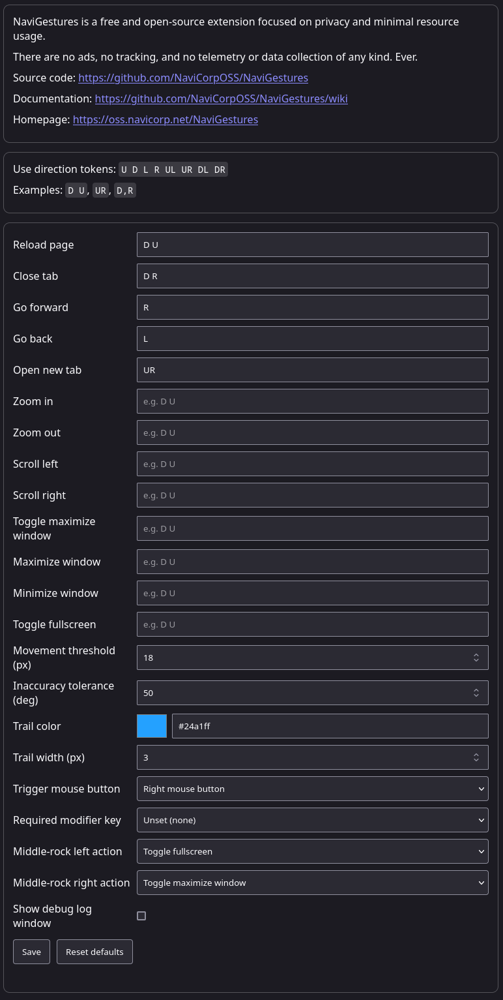

# NaviGestures

NaviGestures is a lightweight, privacy-focused mouse gesture extension for Firefox and Chromium-based browsers.

## What it can do

- Trigger browser actions with mouse gestures (draw directions while holding the configured trigger button).
- Trigger actions with middle-button rocker input (left/right press or wheel tilt, depending on hardware).
- Customize gesture mappings and rocker-left/rocker-right actions from the options page.
- Tune gesture behavior (movement threshold, direction tolerance, trail color/width, trigger button/modifier).

Supported actions include:

- Back / Forward
- Reload page
- Close tab
- New tab
- Zoom in / Zoom out
- Scroll left / Scroll right
- Maximize window / Minimize window
- Toggle maximize window
- Toggle fullscreen

Configuration:



## Build packages

Run:

```bash
./build.sh
```

This creates:

- `dist/firefox/` and `dist/chrome/` (unpacked extension directories)
- `dist/firefox.xpi`
- `dist/chrome.zip`

## Load in browser

- Firefox: load `dist/firefox/` as a temporary add-on, or install `dist/firefox.xpi`.
- Chromium browsers: load `dist/chrome/` as an unpacked extension.

## Privacy

NaviGestures does not include ads, tracking, telemetry, or data collection of any kind and never will.
We do not accept donations or sponsorships to avoid becoming beholden to outside interests.

